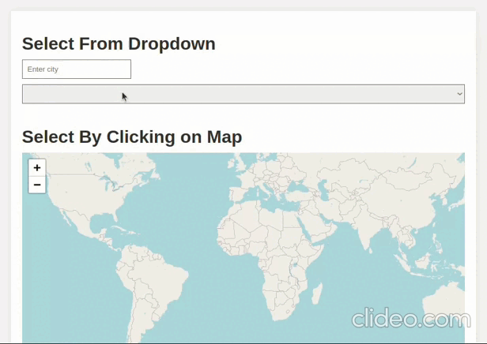

# **Geo City Laravel Application**

## **Project Demo**

## **Project Report**

### Introduction
The Geo City Laravel application is designed to load and manage location data from the provided Geo City Lite CSV file into a NoSQL database, and provide users with the ability to search for the five closest cities to a specified point on Earth. The application utilizes Laravel, a PHP web application framework, and MongoDB as the NoSQL database management system.

### Objectives

1. **Select a NoSQL DBMS**
   - MongoDB is chosen as the NoSQL DBMS for its flexibility in handling document-oriented data.

2. **Load Data from GeoCityLite file**
   - The application checks if data is already loaded in the database. If not, it reads the Geo City Lite CSV file and loads the data into MongoDB.

3. **Query the Selected DBMS**
   - The application defines a MongoDB service provider to establish a connection and provides methods to query the database.

4. **Create an Interface for User Interaction**
   - Two methods are provided for user interaction:
     - Users can select a city from a dropdown, and the application calculates the lat/lon for the selected city from the stored data.
     - Users can click on the map to select a point, and the application uses reverse geocoding to identify the city.

5. **Identify Cities Closest to the Selected Location**
   - The application uses the "The Great Circle Distance Formula" to find the five closest cities to the selected location (either specified by the user or obtained through reverse geocoding).

6. **List the Closest 5 Cities with AJAX**
   - The closest cities are listed dynamically using AJAX to avoid page reloading.

7. **Built Using Laravel**
   - The entire application is developed using the Laravel framework, ensuring a robust and maintainable structure.

### Tools/Software Requirements

- **NoSQL DBMS**: MongoDB is used for storing and retrieving location data.
- **Web Application Framework**: Laravel is chosen as the PHP framework for building the application.

### Implementation Details

#### MongoDB Connection Configuration (.env)
- Connection details such as host, port, database name, username, and password are configured in the `.env` file.

#### MongoDB Service Provider (app/Providers/MongoServiceProvider.php)
- A service provider is defined to establish a MongoDB connection and provide access to the database.

#### Routes Configuration (routes/web.php)
- Two routes are defined: the main route for rendering the map interface and a route (`/get_data`) to fetch data from MongoDB.

#### Map Interface (resources/views/map.php)
- The user interface is created using HTML and JavaScript.
- Leaflet library is used for rendering the map.
- AJAX is employed to fetch data dynamically without page reloads.
- Users can input a city name or select a city from the dropdown, and the application calculates the lat/lon for the selected city.
- Users can also click on the map, and the application uses reverse geocoding to determine the selected city.

#### Loading Spinner
- A loading spinner is implemented to provide visual feedback during AJAX requests.

### Worldwide Web Concepts

1. **RESTful Routes**
   - The routes defined follow RESTful principles, providing clear and intuitive endpoints for different functionalities.

2. **AJAX for Asynchronous Requests**
   - Asynchronous JavaScript and XML (AJAX) is utilized to fetch data from the server without requiring a page reload, enhancing user experience.

3. **Leaflet for Interactive Maps**
   - Leaflet is used as a JavaScript library for interactive maps, allowing users to click on the map to select a location.

4. **Environmental Variables in .env**
   - Sensible information such as database connection details is stored as environment variables to enhance security.

5. **Service Providers for Dependency Injection**
   - Laravel service providers are used for dependency injection, ensuring a clean and organized structure.

### Conclusion
The Geo City Laravel application successfully fulfills its objectives by leveraging Laravel, MongoDB, and various web concepts to provide users with an intuitive interface for exploring and finding the closest cities based on specified locations. The use of asynchronous requests, map integration, and a clean code structure contribute to a responsive and user-friendly application.